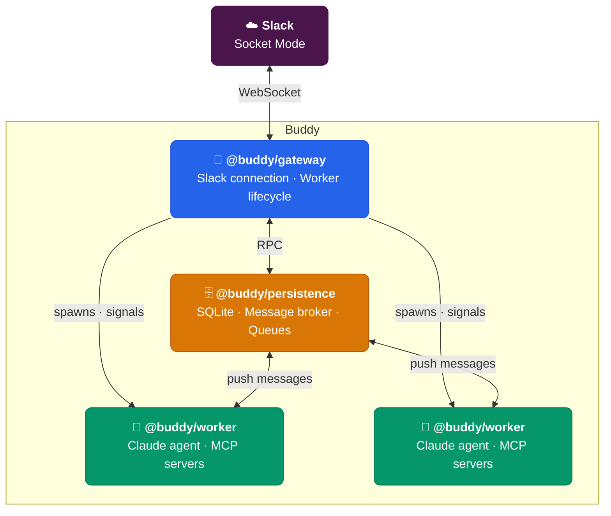

# 🤖 Buddy

**Claude Code, untethered from the terminal.**

[Claude Code](https://docs.anthropic.com/en/docs/claude-code) is powerful — but it's locked to your laptop. You need a terminal open, your machine running, and you have to be *there*. Buddy breaks it free. It puts the same Claude agent with real tools into Slack, where you can reach it from anywhere — your phone on the train, your iPad on the couch, a browser at a coffee shop.

Run it on the same machine as Claude Code and it picks up your existing auth, plugins, and settings automatically. No separate configuration needed.

Same brain. Same tools. Any device. Any time.

---

## 🤔 Why not just use Claude Code?

**You can use both.** Buddy isn't a replacement — it's Claude Code that follows you everywhere.

| | Claude Code | Buddy |
|---|---|---|
| 📍 **Where** | Your terminal | Slack — phone, tablet, browser, desktop |
| ⏰ **When** | Machine open, terminal running | Always on. Message it at 2am from your phone. |
| 👥 **Who** | Just you | Just you, or a group of selected people. |
| 🔄 **How** | Interactive session | Fire and forget. Check back when it's done. |

Buddy runs on your laptop or server — always on, always connected to Slack. You mention it from any device, it does the work, you check the results whenever.

📱 **Kick off a deploy from your phone.** 💻 Review a PR from your tablet. 🔍 Ask it to investigate a production issue while you're away from your desk. Come back to a thread full of findings.

> 🔒 **Solo use?** Create a private Slack workspace or channel. Buddy works the same way — you get the mobility of Slack as a client without sharing access with anyone.

---

## ⚡ What can it do?

> **@Buddy** find the PR that broke the login flow last Tuesday, then check out that branch and run the tests

Buddy searches your Slack history for context, checks out the branch, runs the test suite, and reports back — all within the thread. You watch it work in real time via streaming updates, or check back later.

**Built-in tools:**

| | |
|---|---|
| 💬 **Slack Tools** | Search messages, read threads, fetch history, upload/download files |
| 🖥️ **Interactive Bash** | Persistent terminal for interactive CLI tools and long-running processes |
| 🔗 **VS Code Tunnel** | Spins up remote tunnel links for live pair-programming |
| 🎛️ **Dispatch Control** | Internal coordination between worker processes |

🧩 **Extend it the Claude Code way.** Install [plugins, skills, and MCP servers](https://docs.anthropic.com/en/docs/claude-code) through Claude Code's ecosystem — Buddy picks them all up automatically after a restart. No separate plugin system to learn.

**And it's not just a chatbot:**

- 🧵 **Thread = session.** Each Slack thread gets its own isolated Claude worker. No cross-talk, full context across messages.
- ✅ **Smart permissions.** Approve `git status` once → Buddy auto-approves similar read-only git commands. No click fatigue.
- 📝 **Diffs before damage.** File edits show inline diffs right in Slack. Review before it lands.
- 🧠 **Two-speed brain.** Complex work runs on Sonnet. Quick `!commands` run on Haiku — never blocks the main session.

---

## 🚀 Get running in 5 minutes

**You need:** Node.js >= 24

```bash
git clone https://github.com/ms-ponyo/buddy.git
cd buddy
npm install
cp .env.example .env
```

Fill in three values:

```bash
SLACK_BOT_TOKEN=xoxb-...    # from your Slack app
SLACK_APP_TOKEN=xapp-...    # Socket Mode token
PROJECT_DIR=/your/project   # where Claude works
# Auth: run `claude login` first, or Buddy picks up existing Claude Code auth
```

Then:

```bash
npm run build
npm start
```

That's it. Mention Buddy in a channel or DM it. 🎉

<details>
<summary>🔧 <b>Setting up the Slack app from scratch</b></summary>

<br>

Head to [api.slack.com/apps](https://api.slack.com/apps) → **Create New App** → **From scratch**.

**Socket Mode** — Enable it. Generate an App-Level Token with `connections:write` scope. That's your `SLACK_APP_TOKEN`.

**Bot Token Scopes** (OAuth & Permissions):

| | | |
|---|---|---|
| `app_mentions:read` | `channels:history` | `channels:read` |
| `chat:write` | `files:read` | `files:write` |
| `groups:history` | `groups:read` | `im:history` |
| `im:read` | `reactions:read` | `users:read` |

**Event Subscriptions** — Subscribe to:

| | | |
|---|---|---|
| `app_mention` | `message.channels` | `message.groups` |
| `message.im` | `reaction_added` | |

**Install** to your workspace. The Bot User OAuth Token is your `SLACK_BOT_TOKEN`.

> 💡 Want `search_messages`? Add a User Token (`xoxp-...`) with `search:read` scope and set `SLACK_USER_TOKEN`.

</details>

---

## 🏗️ Under the hood

Four packages. Three processes. One monorepo.



The **gateway** holds the Slack connection, spawns workers, and routes stream updates back to Slack. **Persistence** is the message broker — every inbound and outbound message flows through its SQLite queues. It push-delivers messages to workers the moment they're available.

Every Slack thread gets a dedicated worker process. If one crashes, the others keep running. Persistence re-queues unacknowledged messages, and gateway auto-respawns the worker.

📖 Curious about the internals? Read the full [Architecture doc](docs/architecture.md) — message flows, permission system, session lifecycle, and design decisions.

---

## ⚙️ Configuration

<details>
<summary><b>All environment variables</b></summary>

<br>

| Variable | Required | Default | Description |
|----------|----------|---------|-------------|
| `SLACK_BOT_TOKEN` | Yes | — | Bot User OAuth Token (`xoxb-...`) |
| `SLACK_APP_TOKEN` | Yes | — | App-Level Token for Socket Mode (`xapp-...`) |
| `PROJECT_DIR` | Yes | — | Working directory for Claude |
| `CLAUDE_MODEL` | No | `claude-opus-4-6` | Claude model for main workers |
| `DISPATCH_MODEL` | No | `claude-haiku-4-5-20251001` | Model for lite workers (`!commands`) |
| `PERMISSION_MODE` | No | `default` | `default` · `acceptEdits` · `bypassPermissions` · `dontAsk` |
| `PERMISSION_DESTINATION` | No | `projectSettings` | Where to persist permission patterns |
| `LOG_LEVEL` | No | `debug` | `debug` · `info` · `warn` · `error` |
| `ALLOWED_USER_IDS` | No | *(all)* | Comma-separated Slack user IDs |
| `ALLOWED_CHANNEL_IDS` | No | *(all)* | Comma-separated channel IDs |
| `ADMIN_USER_IDS` | No | — | Admin Slack user IDs |
| `SLACK_USER_TOKEN` | No | — | User token for search (`xoxp-...`) |
| `TRIGGER_EMOJI` | No | `robot_face` | Emoji reaction trigger |
| `PREVIEW_MODE` | No | `moderate` | `off` · `moderate` · `destructive` |
| `PROJECT_MAPPINGS_FILE` | No | — | Channel → project directory mappings |

</details>

---

## 📚 Learn more

- 🏛️ **[Architecture](docs/architecture.md)** — How the pieces fit together, message flows, design decisions
- 🔐 **[Permission System](docs/permission-system.md)** — Wildcard patterns and auto-approval
- ❓ **[Help Modal](docs/help-modal-usage.md)** — The `!help` command
- ☑️ **[Multi-Select Components](docs/multiselect-components.md)** — Checkbox UI for Slack

## 🤝 Contributing

See [CONTRIBUTING.md](CONTRIBUTING.md).

## 📄 License

[MIT](LICENSE)
