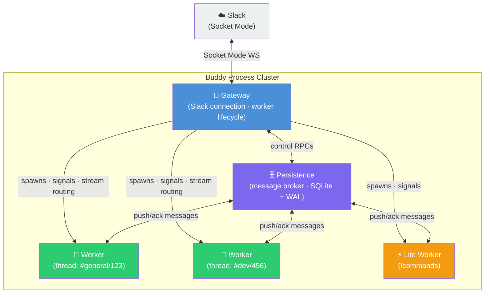
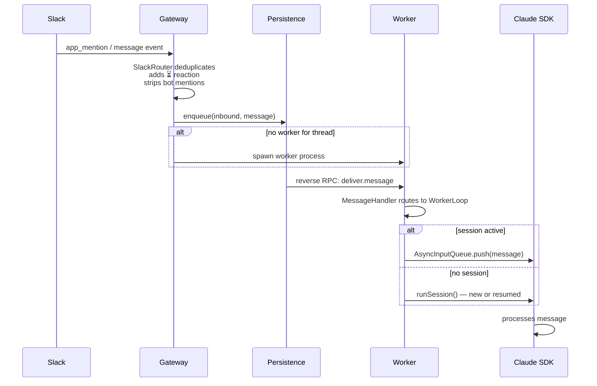
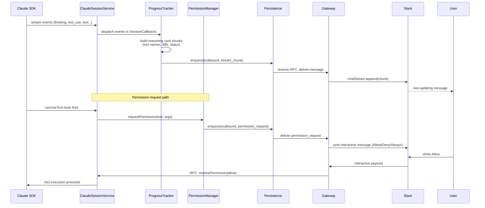
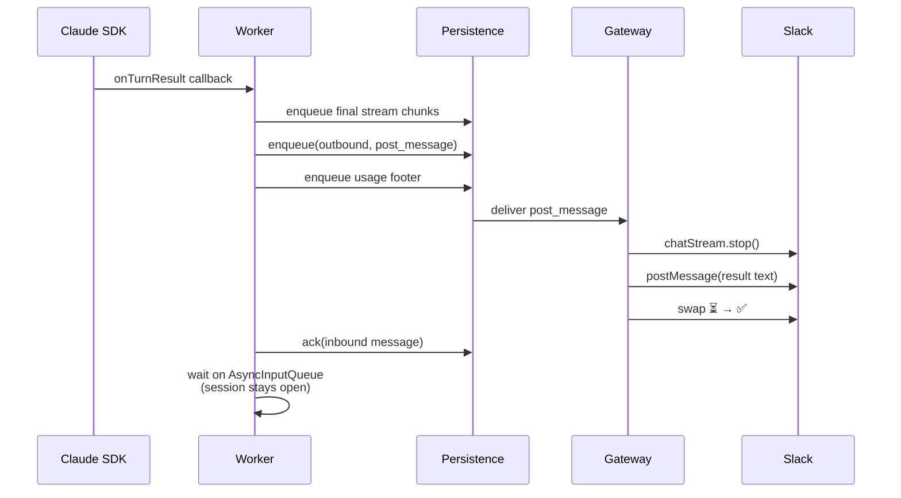
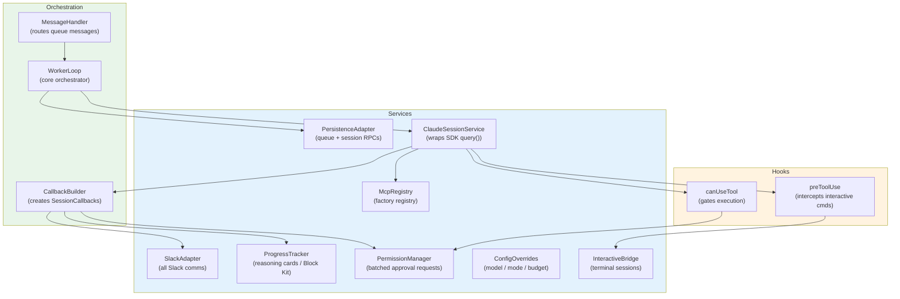
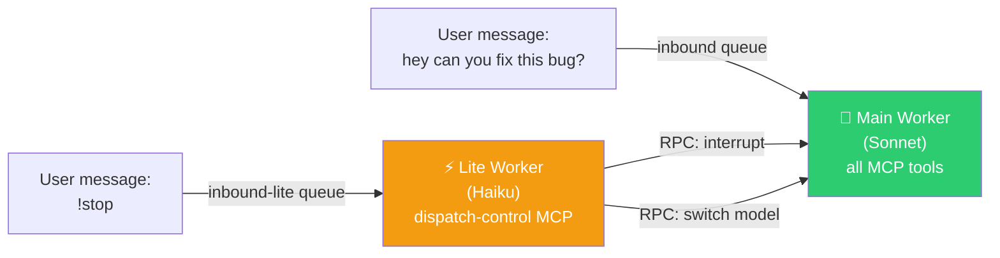

# Buddy Architecture

> This document describes Buddy's internal architecture. For setup and usage, see the [README](../README.md).

Buddy is a TypeScript monorepo Slack bot powered by Claude AI. It's structured as a cluster of cooperating processes — not a single server — where each Slack conversation gets its own Claude session in its own worker process. This document covers the process model, IPC protocol, message flows, and design rationale well enough that you can add features or track down bugs.

---

## Table of Contents

1. [High-Level Overview](#high-level-overview)
2. [Process Model](#process-model)
3. [IPC Protocol](#ipc-protocol)
4. [Message Flows](#message-flows)
5. [Worker Architecture](#worker-architecture)
6. [Two-Tier Workers](#two-tier-workers)
7. [MCP Server System](#mcp-server-system)
8. [Permission System](#permission-system)
9. [Persistence Layer](#persistence-layer)
10. [Streaming & Real-Time Updates](#streaming--real-time-updates)
11. [Resilience](#resilience)
12. [Design Decisions](#design-decisions)
13. [Key Files](#key-files)

---

## High-Level Overview



Four process types, all communicating over Unix domain sockets using JSON-RPC 2.0. All inbound and outbound messages flow through persistence's durable queues. Gateway manages the Slack connection, worker lifecycle, and routes stream updates back to Slack.

| Process | Count | Role |
|---------|-------|------|
| Gateway | 1 (always running) | Slack connection, worker lifecycle, stream routing |
| Persistence | 1 (always running) | SQLite message broker, sessions, process registry |
| Worker | 1 per Slack thread | Claude Sonnet session, MCP tools |
| Lite Worker | 1 per thread (on demand) | `!commands` dispatch via Claude Haiku |

---

## Process Model

### Gateway

The gateway is the only process with a persistent Slack connection. It uses `@slack/bolt` in Socket Mode so no inbound ports are needed — it dials out to Slack's servers and keeps the WebSocket alive.

Responsibilities:
- Receive Slack events (`app_mention`, `message`) and enqueue them into persistence
- Spawn and tear down worker processes via `WorkerManager`
- Receive outbound stream chunks from workers and feed them to Slack's `chatStream` API for live-updating messages
- Apply rate limiting on Slack API calls (token bucket, 40 tokens/min)
- Forward interactive button payloads (Allow/Deny permission clicks) to the correct worker

### Worker

One worker per Slack thread. Workers are spawned by the gateway when a new thread receives its first message. They stay alive (holding an open Claude SDK session) until idle for 30 minutes.

Responsibilities:
- Run a Claude Agent SDK session via `@anthropic-ai/claude-agent-sdk`
- Host in-process MCP servers (slack-tools, interactive-bash, vscode-tunnel)
- Gate tool execution through the permission system
- Stream progress updates to the persistence outbound queue

### Lite Worker

A lightweight sibling to the main worker. When a user sends a `!command` (like `!stop` or `!model sonnet`), a lite worker is spawned for that thread. It uses Claude Haiku — fast and cheap — and has only the `dispatch-control` MCP server, which lets it control the main worker via RPC.

Idle timeout: 5 minutes.

### Persistence

A single long-running SQLite process. Every other process connects to it. Persistence is the message broker — all inbound and outbound messages are durably queued here before delivery. It also stores session IDs, cost data, and the process registry.

Push-based: persistence doesn't wait for workers to poll. It uses reverse RPC to push messages to connected workers the moment they're available.

---

## IPC Protocol

All inter-process communication uses **JSON-RPC 2.0** over **Unix domain sockets**, with messages delimited by newlines.

The key property: the protocol is **bidirectional**. Both the server side and client side can initiate calls — this is what enables persistence to push messages to workers without workers polling.

### Socket Paths

| Process | Socket Path |
|---------|-------------|
| Persistence | `/tmp/buddy/persistence.sock` |
| Gateway | `/tmp/buddy/gateway.sock` |
| Worker | `/tmp/buddy/worker-{threadKey}.sock` |
| Lite Worker | `/tmp/buddy/lite-worker-{threadKey}-{purpose}.sock` |

### Connection Lifecycle

When a worker or gateway connects to persistence, it calls `identify()` with its process type, thread key, and socket path. Persistence records this in the `process_registry` table.

On disconnect, persistence:
1. Resets any `delivered` messages for that client back to `pending`
2. Removes the client from the process registry

This is how crash recovery works — messages are never lost, just re-queued.

### Auto-Reconnect

Both `RpcServer` and `RpcClient` (in `@buddy/shared`) handle reconnection automatically. Backoff starts at 100ms and caps at 5 seconds.

---

## Message Flows

### Inbound Flow (User → Claude)



Key points:
- **Deduplication** happens in SlackRouter before anything is queued — Slack occasionally delivers events twice.
- **Hourglass reaction** (`⏳`) is added immediately so users get feedback that the message was received.
- **Bot mention stripping**: `@Buddy` prefixes are removed from the message text before passing to Claude.
- The `AsyncInputQueue` is the bridge between persistence's push delivery and the SDK's pull-based streaming interface.

### Execution Flow (Streaming + Tools)



### Outbound Flow (Claude → Slack)



The session doesn't close between messages. The worker sits idle on `AsyncInputQueue.next()`, and the SDK keeps its conversation context in memory. The next user message arrives via the same push-delivery path and gets injected directly into the running session.

---

## Worker Architecture

Workers follow a layered design, assembled by `createWorkerContext()` in `context.ts`.



### Adapters Layer

**SlackAdapter** is the single point of contact for all Slack communication from a worker. It has two delivery paths:
- **Durable path**: Messages, reactions-on-completion, file uploads go through the persistence outbound queue. If the worker crashes mid-flight, these still get delivered.
- **Ephemeral path**: Typing indicators and in-progress reactions go directly to gateway via RPC. It's fine if these are lost on restart.

**PersistenceAdapter** wraps all persistence RPC calls: reading/writing sessions, enqueuing messages, recording costs.

### Services Layer

**ProgressTracker** turns raw SDK events into Slack Block Kit "reasoning cards" — the expandable sections that show what Claude is thinking and doing. It tracks:
- Tool uses with their names and current status (running / done / error)
- Diffs from file edits
- Thinking text (Claude's extended thinking)
- Todo lists

**PermissionManager** handles the permission approval UX. When multiple tools request permission concurrently (common during parallel tool calls), requests are batched within a 200ms debounce window and shown in a single Slack message with "Allow All (N)" / "Deny All" buttons. This dramatically reduces notification noise.

**McpRegistry** is a named registry of factory functions. Each MCP server is registered as a factory, not an instance, because servers are created fresh per session with runtime environment (credentials, working directory, etc.).

**ClaudeSessionService** is the thin wrapper around the SDK's `query()` function. It handles:
- Streaming SDK events to `SessionCallbacks`
- Session resume via stored session IDs
- Interrupt signals (from `!stop` commands via the lite worker)
- Permission mode changes mid-session

**ConfigOverrides** holds runtime-mutable config: active model, permission mode, thinking effort, token budget. Updated by `!commands` and persisted across restarts.

**InteractiveBridge** manages interactive terminal sessions — when Claude is running an interactive process (like a debugger or REPL), this bridge pipes stdin/stdout between Slack messages and the PTY.

### Orchestration Layer

**WorkerLoop** is the heart of the worker. It owns the `AsyncInputQueue` — a simple async queue that bridges the push-delivery world (persistence) and the pull-delivery world (SDK). The loop:
1. Starts a Claude SDK session
2. Feeds queued messages into the session as they arrive
3. On session end, checks if more messages are waiting (starts new session if so)
4. Handles session resume: tries to resume from stored session ID; falls back to fetching thread history from Slack

**MessageHandler** receives raw queue message payloads and routes them to the right handler. Most messages go to `WorkerLoop.handleMessage()`, but some (like config updates) are handled directly.

**CallbackBuilder** is a factory for `SessionCallbacks` — the set of callbacks that `ClaudeSessionService` calls during streaming. Separating construction keeps the callback wiring testable.

### Hooks

**canUseTool**: Called by the SDK before each tool execution. The hook:
- Auto-allows "info" tools: `Read`, `Grep`, `Glob`, `WebFetch` (no side effects)
- Checks `acceptEdits` mode for file-modifying tools
- For everything else, calls `PermissionManager.request()` and awaits user approval

**preToolUse**: Pattern-based. When Claude uses `Bash` with a command that looks interactive (e.g., launching a debugger), this hook intercepts and activates `InteractiveBridge` instead of running the command directly.

---

## Two-Tier Workers

Every Slack thread that has an active Buddy conversation has one **main worker** (Claude Sonnet) and optionally one **lite worker** (Claude Haiku).



Messages starting with `!` are routed to the `inbound-lite` queue. The lite worker's `dispatch-control` MCP server exposes RPC tools like:
- `interrupt` — stops the main worker's current tool execution
- `switchModel` — changes the model for the next session
- `fork` — creates a branch of the conversation

Why keep them separate? `!stop` needs to work even when Claude is mid-thought on a complex multi-tool task. If everything ran in the same process, handling the stop command would require interrupting the SDK in a thread-safe way. The two-process model sidesteps this: the lite worker just sends an RPC call to the main worker's socket, and the main worker handles it at a safe checkpoint.

---

## MCP Server System

MCP servers run **in-process** within each worker, not as external processes. They're registered as factories in `McpRegistry` and instantiated once per session.

### Registered Servers

| Name | Available In | Description |
|------|-------------|-------------|
| `slack-tools` | Main worker | Search messages, read threads, upload/download files |
| `interactive-bash` | Main worker | Persistent bash session with PTY via `node-pty`, maintains cwd |
| `vscode-tunnel` | Main worker | VS Code tunnel management (status, login, install) |
| `dispatch-control` | Lite worker only | RPC tools to control the main worker |

### Factory Pattern

```ts
mcpRegistry.registerFactory('slack-tools', () => createSlackToolsServer(slackAdapter));
mcpRegistry.registerFactory('interactive-bash', () => createInteractiveBashServer());
```

Factories receive the runtime environment (adapter instances, credentials) via closure. When `ClaudeSessionService` starts a session, it calls each registered factory and passes the resulting servers to the SDK. Servers are not shared across sessions.

### Adding Your Own MCP Server

See the [README](../README.md) for the walkthrough. The short version: implement the server, register a factory in `McpRegistry`, and the SDK will automatically offer it to Claude at session start.

---

## Permission System

The permission system has three layers that compose together.

### Layer 1: Permission Mode

Set via `ConfigOverrides` or `!mode` command. Controls the overall posture.

| Mode | Behavior |
|------|----------|
| `default` | Ask for approval on potentially destructive tools |
| `acceptEdits` | Auto-allow file modifications, ask for shell/network |
| `bypassPermissions` | Allow everything without asking (use with care) |
| `dontAsk` | Never ask — deny anything that would require approval |
| `plan` | Read-only mode; no write tools allowed |
| `auto` | Claude decides based on task context |

### Layer 2: Tool Classification

The `canUseTool` hook classifies each tool use before deciding whether to ask:

- **Info tools** (`Read`, `Grep`, `Glob`, `WebFetch`): Always allowed — they have no side effects.
- **File tools**: Allowed when mode is `acceptEdits` or higher.
- **Risk classification**: Other tools are tagged as `destructive`, `moderate`, or `info` based on their name and arguments.

### Layer 3: Interactive Approval

When the hook decides to ask, it calls `PermissionManager.request()`. The manager:

1. Collects incoming requests for 200ms (debounce window)
2. Posts a single Slack message with buttons for each pending tool
3. Includes "Allow All (N)" and "Deny All" shortcuts when there are multiple

**"Always Allow" flow:**
- The SDK suggests wildcard patterns (e.g., `Bash(git add:*)`)
- If no SDK suggestion, the worker parses the bash command and generates a fallback pattern
- User clicks "Always" → pattern sent to SDK as a session-scoped `updatedPermissions` rule
- For file tools, "Always" switches the session to `acceptEdits` mode

**Batch permissions** make parallel tool use much less noisy. When Claude runs 5 bash commands in parallel, they all hit `canUseTool` within milliseconds of each other. Without batching, the user gets 5 separate Slack messages. With the 200ms window, they get one.

---

## Persistence Layer

Persistence is a dedicated SQLite process using `better-sqlite3` with WAL mode enabled. WAL allows readers and the single writer to run concurrently, which matters because gateway and multiple workers all query it.

### Tables

**`queue_messages`** — The message broker backbone.

| Column | Type | Description |
|--------|------|-------------|
| `id` | INTEGER PK | Auto-increment |
| `queue` | TEXT | `inbound`, `outbound`, or `inbound-lite` |
| `thread_key` | TEXT | Slack channel + thread timestamp |
| `status` | TEXT | `pending` → `delivered` → `ack` / `nack` / `deadlettered` |
| `payload` | JSON | Full message payload |
| `retry_count` | INTEGER | Incremented on nack |
| `created_at`, `updated_at` | DATETIME | Timestamps |

**`sessions`** — One row per Slack thread.

| Column | Type | Description |
|--------|------|-------------|
| `thread_key` | TEXT PK | Slack channel + thread timestamp |
| `session_id` | TEXT | Claude SDK session ID for resume |
| `cost` | REAL | Cumulative API cost |
| `plan_path` | TEXT | Path to active plan file (if any) |
| `metadata` | JSON | Arbitrary per-thread metadata |

**`process_registry`** — Live worker tracking.

| Column | Type | Description |
|--------|------|-------------|
| `type` | TEXT | `gateway`, `worker`, `lite-worker` |
| `thread_key` | TEXT | Thread this process serves |
| `pid` | INTEGER | OS process ID |
| `socket_path` | TEXT | Unix socket path for this process |
| `purpose` | TEXT | Lite worker purpose tag |

### DeliveryLoop

The `DeliveryLoop` is persistence's push mechanism — it's what eliminates polling:

```
loop:
  1. Pull next pending message (ordered by id)
  2. Mark as "delivered"
  3. server.callClient('deliver.message', payload)  ← reverse RPC
  4. Park (sleep indefinitely)
  5. Wake triggered by: new enqueue, nack from worker, or client reconnect
```

If the worker crashes between steps 3 and 5 (never acks), the disconnect handler resets `delivered` → `pending` and the loop re-delivers to the next worker instance.

### Message Status Transitions

```
pending → delivered → ack         (success)
                    → nack         (worker rejected, will retry)
                    → deadlettered (retry_count exceeded max)
```

---

## Streaming & Real-Time Updates

Buddy uses Slack's `chatStream` API to show Claude's work in real time — users see tool executions and thinking appear as Claude works, not just a final answer at the end.

### ProgressTracker Output

ProgressTracker transforms SDK events into Slack Block Kit sections called "reasoning cards":

- **Tool status**: `🔧 Running bash...` → `✅ bash (0.4s)` on completion
- **Diffs**: File edits shown as collapsible diff blocks
- **Thinking**: Claude's extended reasoning in a collapsed section
- **Todos**: Task lists with checkboxes, updated as items complete

These chunks are enqueued to the outbound queue and forwarded by gateway to the active `chatStream`.

### StreamRouter

Gateway's `StreamRouter` manages one stream buffer per active thread. Constraints:

- **Rotation**: Every 4.5 minutes. Slack's `chatStream` has a 5-minute server-side timeout, so streams are rotated before they expire.
- **Size limit**: 35KB per stream message. Near the limit, a new stream message is started.
- **Cleanup**: If a stream message is stopped while still empty (Claude responded in under a second), the empty message is deleted.

---

## Resilience

### Crash Recovery

On startup, gateway queries persistence for threads with `pending` messages that have no running worker. For each such thread, it spawns a new worker. The worker connects to persistence, and `DeliveryLoop` re-delivers the pending messages.

No messages are lost. The only visible effect is a slightly delayed response.

### Session Resume

When a worker spawns for a thread that has a previous `session_id` in the `sessions` table, it attempts to resume via the SDK's resume mechanism. If resume fails (session expired, SDK error), it falls back:

1. Fetch the thread's message history from Slack
2. Construct a synthetic conversation context
3. Start a fresh SDK session with that history as context

### Rate Limiting

Slack's API has rate limits per method and per workspace. Gateway maintains a token bucket (40 tokens/min) and queues outbound calls. On a 429 response, all calls pause for the `retryAfter` duration Slack provides in the response header.

### Idle Shutdown

Workers self-terminate when idle:
- Main workers: 30-minute timeout
- Lite workers: 5-minute timeout

The timeout resets each time a message arrives. On shutdown, the worker closes its socket cleanly, which triggers persistence to deregister it.

### Hot Reload

The `!update` command triggers a zero-downtime update cycle:
1. `git pull`
2. `npm install`
3. `npm run build`
4. Gateway sends restart signals to all workers
5. Workers finish their current turn, then respawn with the new binary
6. Gateway itself does not restart — Slack connection stays alive

---

## Design Decisions

These are the "why" answers for the architectural choices that might otherwise look surprising.

### 1. Separate Processes, Not a Single App

Each Slack thread gets its own worker process. Crashes are isolated — a runaway tool in one conversation can't corrupt another. Workers can be independently restarted, updated, or killed without touching the gateway or other conversations.

The cost is IPC complexity. The benefit is that production incidents are contained.

### 2. Push Delivery, Not Polling

Workers don't poll for messages. Persistence pushes via reverse RPC the moment a message is enqueued. This means zero CPU overhead when conversations are idle (which is most of the time), and instant delivery when they're not.

### 3. Long-Running Sessions, Not Per-Message

The Claude SDK session stays alive across multiple user messages via `AsyncInputQueue`. Claude holds the full conversation in its context window without needing to reload history from the database on each message. Session resume handles the case where the worker restarts.

The alternative — starting a fresh SDK session per message and reloading history — would be slower and more expensive.

### 4. Two-Tier Workers

`!commands` need instant responses. If they ran on the main worker, `!stop` would have to interrupt an active SDK streaming call — messy and error-prone. Running `!commands` on a separate Haiku process with an RPC channel to the main worker is clean: the lite worker sends a signal, the main worker handles it at a safe point.

Haiku is also significantly cheaper than Sonnet. Dispatch commands are simple enough that Sonnet is overkill.

### 5. Permission Batching

During a turn where Claude makes parallel tool calls, multiple `canUseTool` invocations fire within milliseconds. Without batching, each one posts a separate Slack message. The 200ms debounce window collects them into one message with an "Allow All (N)" button. This makes the permission UX usable rather than spammy.

### 6. Persistence as Message Broker

All inbound and outbound messages flow through SQLite queues before delivery. This gives:
- **Durability**: Messages survive crashes of gateway, workers, or both
- **Decoupling**: Gateway and workers don't need direct connections to each other for message passing
- **Observability**: The `queue_messages` table is a complete audit log of every message

The trade-off is an extra hop on every message. In practice, SQLite with WAL is fast enough that this hop is negligible.

---

## Key Files

This section maps architectural concepts to their source locations in the monorepo.

### Packages

| Package | Path | Role |
|---------|------|------|
| `@buddy/gateway` | `packages/gateway/` | Gateway process |
| `@buddy/worker` | `packages/worker/` | Worker + lite worker processes |
| `@buddy/persistence` | `packages/persistence/` | Persistence process |
| `@buddy/shared` | `packages/shared/` | Shared types, RPC classes, utilities |

### Gateway

| Concept | File |
|---------|------|
| Entry point | `packages/gateway/src/index.ts` |
| Slack event routing | `packages/gateway/src/slack/SlackRouter.ts` |
| Worker lifecycle | `packages/gateway/src/workers/WorkerManager.ts` |
| Stream management | `packages/gateway/src/streams/StreamRouter.ts` |
| Rate limiting | `packages/gateway/src/slack/RateLimiter.ts` |
| Interactive payload handling | `packages/gateway/src/slack/InteractiveHandler.ts` |

### Worker

| Concept | File |
|---------|------|
| Context assembly | `packages/worker/src/context.ts` |
| Core orchestration loop | `packages/worker/src/orchestration/WorkerLoop.ts` |
| Queue message routing | `packages/worker/src/orchestration/MessageHandler.ts` |
| SDK session wrapper | `packages/worker/src/services/ClaudeSessionService.ts` |
| Reasoning card builder | `packages/worker/src/services/ProgressTracker.ts` |
| Permission batching | `packages/worker/src/services/PermissionManager.ts` |
| MCP server registry | `packages/worker/src/mcp/McpRegistry.ts` |
| Slack communication | `packages/worker/src/adapters/SlackAdapter.ts` |
| Persistence RPC | `packages/worker/src/adapters/PersistenceAdapter.ts` |
| Tool execution gate | `packages/worker/src/hooks/canUseTool.ts` |
| Interactive terminal hook | `packages/worker/src/hooks/preToolUse.ts` |
| Runtime config | `packages/worker/src/services/ConfigOverrides.ts` |
| Async input queue | `packages/worker/src/orchestration/AsyncInputQueue.ts` |
| Callback wiring | `packages/worker/src/orchestration/CallbackBuilder.ts` |

### MCP Servers

| Server | File |
|--------|------|
| slack-tools | `packages/worker/src/mcp/servers/slack-tools.ts` |
| interactive-bash | `packages/worker/src/mcp/servers/interactive-bash.ts` |
| vscode-tunnel | `packages/worker/src/mcp/servers/vscode-tunnel.ts` |
| dispatch-control | `packages/worker/src/mcp/servers/dispatch-control.ts` |

### Persistence

| Concept | File |
|---------|------|
| Entry point | `packages/persistence/src/index.ts` |
| SQLite setup | `packages/persistence/src/db/database.ts` |
| Queue operations | `packages/persistence/src/db/QueueRepository.ts` |
| Session operations | `packages/persistence/src/db/SessionRepository.ts` |
| Process registry | `packages/persistence/src/db/ProcessRegistry.ts` |
| Push delivery loop | `packages/persistence/src/delivery/DeliveryLoop.ts` |
| RPC handler | `packages/persistence/src/rpc/PersistenceRpcHandler.ts` |

### Shared

| Concept | File |
|---------|------|
| RPC server | `packages/shared/src/rpc/RpcServer.ts` |
| RPC client | `packages/shared/src/rpc/RpcClient.ts` |
| Message types | `packages/shared/src/types/messages.ts` |
| Queue types | `packages/shared/src/types/queue.ts` |
| Session types | `packages/shared/src/types/session.ts` |
